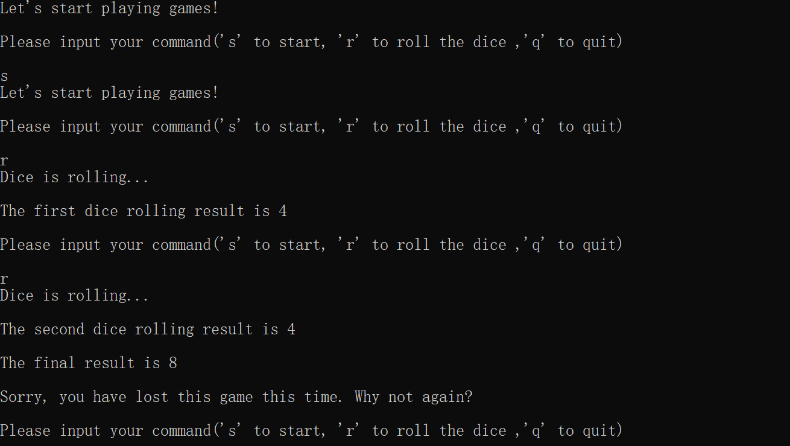
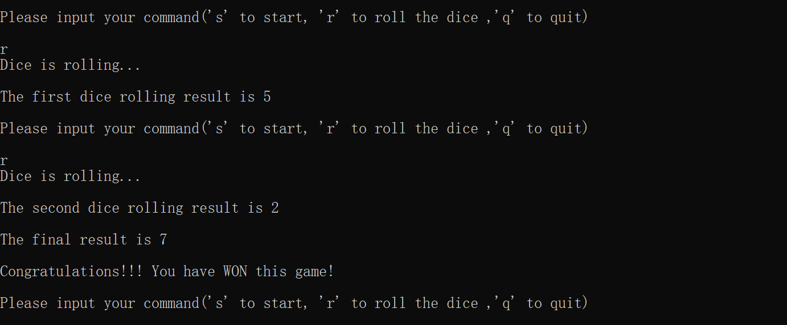
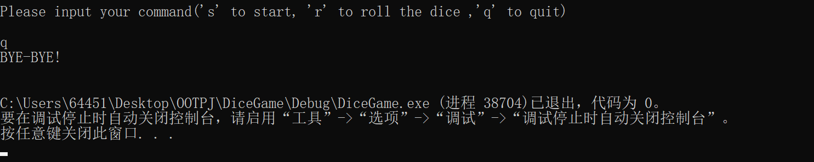

# DiceGame

## Stage 1

### 要求:

- 一个玩家，掷骰子两次，和为 7 则获胜，否则失败。

- 要求控制台介绍游戏规则，并提示操作方式，如Please input your command('s' to start, 'r' to roll the dice ,'q' to quit)。

- 要求打印每次操作后的提示、每次掷骰子的结果，和玩家的胜负        

### 运行结果：

- 输入 s, 开始游戏，打印：Let's start playing games!
- 输入 r, 扔骰子。扔一次打印点数，扔两次打印点数和输赢结果。
- 输入q, 直接结束游戏, 打印：BYE-BYE！

### 构造设计

- 类
  - **CDiceGame**
    - members：
      1. a list of players
    - methods:
      1. startGame
  - **Player**
    - members:
      1. dices: player may have dices
      2. isFinished, isWon: indicating game results
      3. m_turn_round:  current No. of turns
      4. m_curCommand:  current command
    - methods:
      1. playGame: public interface
  - **Dice**
    - members:
      1. upVal: the number facing upwards
    - methods:
      1. rollDice
      2. showVal

## Stage 2

### 要求：

掷骰子游戏的基本规则是：每个玩家掷两次骰子，系统根据用户选择的计分方式给出得分，得分多的为赢家。

考虑这是个支持游戏大厅的应用，有很多玩家，可以预先注册，==系统==可以发起一盘掷骰子游戏（支持同时进行多盘游戏），等待两个玩家加入，用户加入游戏时需要选择计分方式，系统预置的计分方式有【加相后除以6的余数】和【相乘后除以6的余数】。一盘游戏可以支持多轮，即可分几次胜负，每轮需要给出胜负结果。一轮结束后询问第一个加入的用户是否开始下一轮还是结束游戏。如果选择开始下一轮，先打印出前面几轮的胜负结果，然后开始下一轮。选择结束游戏的话也是打印出前面几轮的胜负结果，然后结束游戏。

假设玩家已经注册好，就是说，在主程序中只需要固定写如下的代码，不需要通过交互的方式注册：

Player player1('A')

Player player2('B')

需要用OO的原则对这个应用恰当地进行抽象和封装

### 分析：

1. 游戏中轮与轮之间是不相关的，无状态的，但是需要保存结果
2. VS2019  C++单元测试：https://www.cnblogs.com/puddingcat/p/8620310.html

### 设计思考

1. 设计一个游戏平台类CDiceGamePlatform，这个游戏平台是一个单件。这个游戏平台有很多注册过的players，有注册接口，有登录接口，有开局接口（题目中说系统是可以发起一盘游戏的），而且这个CDiceGamePlatform必须是线程安全的。那就要维护一个容器，容器里维护一个CGameTable（重构CDiceGame），代表一局游戏，每局游戏里有多轮，游戏中有两个玩家，游戏可以有两个积分策略。
2. 所有的CPlayer通过CDiceGamePlatform的注册接口注册
3. 在单线程模型/单元测试下，可以在CDiceGamePlatform中静态的预置一些CGameTable，用户选择加入游戏，当num_player%2==0时，游戏开始，请player1（单线程也区分不开两个用户了orz）选择游戏策略，然后游戏继续进行。
4. 按照题目的情景，其实类似一个C-S模式，涉及到多线程编程，Server端一个CDiceGamePlatform单件常启动，设置服务；客户端CPlayer调用相关服务，显示信息。

### 目前的状态：

1. 开发完成，没测试，没debug，没写UnitTest